## Objectives

- ✅ Define core ML concepts and learning types
- ✅ Identify features, targets, models, algorithms
- ✅ Explain generalization and the bias–variance trade-off
- ✅ Apply the ML workflow in scikit-learn

::: notes
Before we begin, here are our learning objectives for today’s topic. By the end of this introduction, you should be able to:
Define core ML vocabulary — terms like dataset, feature, label, model, and algorithm.
Understand and compare different types of machine learning — supervised, unsupervised, semi- and self-supervised, and reinforcement learning.
Walk through a standard ML workflow using Python and scikit-learn.
Explain the bias–variance tradeoff, which is fundamental to building generalizable models.
And finally, discuss ethical concerns in machine learning and how to design responsible ML systems.
Each of these objectives will align with a section of this lecture.

FOR NOTES:
By the end of this topic, you will be able to:
✅ Define core machine learning concepts and learning types.
✅ Identify features, targets, models, and algorithms.
✅ Explain generalization and bias–variance trade-offs.
✅ Apply the basic machine learning workflow using scikit-learn.
:::

## Outline

- Introduction to machine learning
- Features and models
- Bias-variance tradeoff
- Machine learning workflow

::: notes
Here’s how the topic is structured.
We’ll start with an introduction to machine learning — what it is.
Next, we’ll define features, models, and algorithms — these are the building blocks of any ML system.
Then we’ll walk through a practical machine learning workflow using scikit-learn — from loading data to model evaluation.
After that, we’ll dive into the bias–variance tradeoff — understanding why models can underfit or overfit.
And we’ll wrap up by discussing machine learning ethics — an increasingly important topic in real-world AI deployment.
:::

## Let’s Begin

- ▶︎ Introduction to machine learning
- ⏳ Features and models
- ⏳ Bias-variance tradeoff
- ⏳ Machine learning workflow

::: notes
Throughout the lecture, I’ll be checking in with this progress slide so you know where we are in the overall roadmap.

Right now, we’re at the very beginning: Introduction to machine learning.

We’ll build up from the fundamental question: What is machine learning and how does it work?
:::

## What is Machine Learning?

- Computers learn patterns from data — no rules written by hand
- 🗂️ Input: historical data
- 🔧 Process: learning algorithm
- 🤖 Output: predictive model

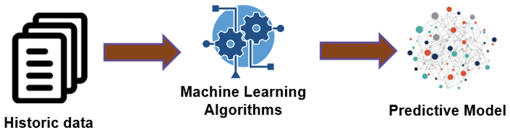

[Machine Learning algorithms, perspectives, and real-world application:](https://mpra.ub.uni-muenchen.de/116579/) Empirical evidence from United States trade data (Sakshi Aggarwal, 2023)

::: notes
So, what exactly is machine learning?

Machine learning is a subfield of artificial intelligence.

It’s focused on building systems that learn patterns from data and make predictions — without being explicitly programmed.

Let’s break that down:
The input is historical data — think of spreadsheets, sensor data, images, or text.
The process is a learning algorithm — this could be linear regression, decision trees, or a neural network.
And the output is a predictive model — a trained function that can make future predictions based on new input data.

Unlike traditional programming, where we write explicit rules, machine learning learns those rules from the data itself.

That’s what makes it so powerful for automation and pattern recognition.

Machine learning uses algorithms and models to make predictions and discover patterns in data.

A model is a mathematical function for describing the relationship between inputs and outputs and making predictions.

An algorithm is a procedure or set of decision rules used to carry out a machine learning task, such as making a prediction.

Machine learning combines tools and theory from computer science, artificial intelligence, statistics, and mathematics to make predictions and apply knowledge to new data.

ML – a subset of AI
What’s in AI and not in ML? Areas of knowledge representation, constraint optimization, logical and probabilistic reasoning, and planning.
AI is about getting systems to perform tasks that typically require human cognition and decision-making abilities.

FOR NOTES:
Machine learning is a subfield of artificial intelligence where computers learn patterns from data and make predictions without being explicitly programmed.
🗂️ Input: Historical data
🔧 Process: Learning algorithm
🤖 Output: Predictive model
:::

## ML vs. Traditional Programming

- **Traditional:** Rules + Data → Computer → Answers
  - You write `if "FREE!!!" in subject: spam`
- **Machine learning:** Data + Answers → Computer → Rules
  - You give 10,000 labeled emails; the algorithm produces the rule: the model.
- 📌 ML is the tool for problems where the rules are too complex, unknown, or constantly changing to write by hand.

::: notes
So, what exactly is machine learning?

Machine learning is a subfield of artificial intelligence.

It’s focused on building systems that learn patterns from data and make predictions — without being explicitly programmed.

Let’s break that down:
The input is historical data — think of spreadsheets, sensor data, images, or text.
The process is a learning algorithm — this could be linear regression, decision trees, or a neural network.
And the output is a predictive model — a trained function that can make future predictions based on new input data.

Unlike traditional programming, where we write explicit rules, machine learning learns those rules from the data itself.

That’s what makes it so powerful for automation and pattern recognition.

Machine learning uses algorithms and models to make predictions and discover patterns in data.

A model is a mathematical function for describing the relationship between inputs and outputs and making predictions.

An algorithm is a procedure or set of decision rules used to carry out a machine learning task, such as making a prediction.

Machine learning combines tools and theory from computer science, artificial intelligence, statistics, and mathematics to make predictions and apply knowledge to new data.

ML – a subset of AI
What’s in AI and not in ML? Areas of knowledge representation, constraint optimization, logical and probabilistic reasoning, and planning.
AI is about getting systems to perform tasks that typically require human cognition and decision-making abilities.

FOR NOTES:
Traditional programming
:::

## Where Machine Learning Fits in AI

- Artificial Intelligence → **Machine Learning (this course)** → Deep Learning → LLMs
- ChatGPT is one member of the family.
- This course teaches the family: the concepts every member shares.

::: notes
Let’s talk about the concept of a model.

In machine learning, a model is a mathematical function that takes input data and maps it to an output.

It makes predictions based on patterns it has learned from the training data.

For example, a linear model might take a feature like distance and use it to predict price, using the formula:
y^=fθ(x)=θ0+θ1x\hat{y} = f_\theta(x) = \theta_0 + \theta_1 xy^=fθ(x)=θ0+θ1x
Here,
xxx is the input feature,
y^\hat{y}y^ is the predicted output,
and θ\thetaθ represents the parameters — values the model learns during training.

The code at the bottom shows how we create and train a model in Python using scikit-learn.

This model learns to fit the best line through the data points — and then we can use it to make predictions on new data.
:::

## What is a Model?

$$\hat{y} = f_{\theta}(x)$$

- Linear example: $f_{\theta}(x) = \theta_0 + \theta_1 x$
- $x$ input · $\hat{y}$ prediction · $\theta$ learned parameters

::: notes
Let’s talk about the concept of a model.

In machine learning, a model is a mathematical function that takes input data and maps it to an output.

It makes predictions based on patterns it has learned from the training data.

For example, a linear model might take a feature like distance and use it to predict price, using the formula:
y^=fθ(x)=θ0+θ1x\hat{y} = f_\theta(x) = \theta_0 + \theta_1 xy^=fθ(x)=θ0+θ1x
Here,
xxx is the input feature,
y^\hat{y}y^ is the predicted output,
and θ\thetaθ represents the parameters — values the model learns during training.

The code at the bottom shows how we create and train a model in Python using scikit-learn.

This model learns to fit the best line through the data points — and then we can use it to make predictions on new data.

FOR NOTES:
A model is a mathematical function that maps input(s) to output(s) to make predictions: $\hat{y} = f_{\theta}(x)$
Example (linear model): $f_{\theta}(x) = \theta_0 + \theta_1 x$, where
$x$: input feature
$\hat{y}$: predicted output
$\theta$: model parameters
:::

## What is an Algorithm?

$$\mathcal{A} : (\textit{data},\ \textit{hyperparameters}) \rightarrow f_{\theta^{*}}$$

- 🗂️ Input: training data and hyperparameters
- 🔧 Process: optimization rules
- 🤖 Output: a trained model $f_{\theta^{*}}$
- Ex: gradient descent trains regression models

::: notes
Now, while the model is the function that makes predictions, the algorithm is what trains that model.

Think of it like this: the model is the structure, and the algorithm is the recipe for filling in that structure with the right values.

An algorithm takes:
Input: training data and hyperparameters
Processes: optimization steps, like gradient descent
Output: a trained model with the best-fitting parameters

In math terms, we can write this as:
A(data,hyperparameters)→fθ∗\mathcal{A}(\text{data}, \text{hyperparameters}) \rightarrow f^*_\thetaA(data,hyperparameters)→fθ∗

For instance, SGDRegressor() in scikit-learn uses stochastic gradient descent to train a model.
It updates the model’s weights gradually as it sees each data point.
So again — the algorithm is the process, and the model is the result.

FOR NOTES:
An algorithm is a step-by-step procedure used to train a model on data.
Examples: gradient descent algorithms are used to train regression models.
It takes:
🔧 Processes: optimization rules
:::

## Model vs Algorithm

- 🤖 Model: a mathematical function that makes predictions
- ⚙️ Algorithm: a method that adjusts the model’s parameters using data
- 📌 These terms are sometimes used interchangeably in casual conversation.

::: notes
Let’s pause and clarify this distinction:

A model is the mathematical function that makes predictions.
Once trained, it can be reused over and over to predict outcomes.

An algorithm is the method used to train the model.
It iteratively adjusts the model’s parameters to reduce error.

This distinction is subtle but really important, especially when we start talking about training, optimization, and deployment.
:::

## Example: Predicting Rideshare Price

Goal: Predict the price of a ride using input features.

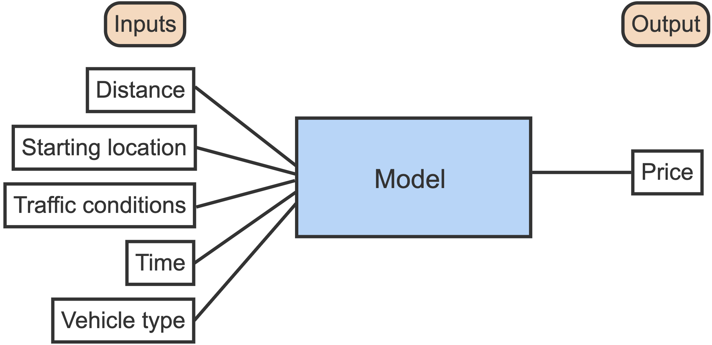

[Machine Learning](https://www.zybooks.com/catalog/machine-learning/) (zyBooks, 2025)

::: notes
Let’s walk through a practical example of a machine learning system.

Suppose we want to predict the price of a rideshare trip.

Our input features might include:
Distance
Starting location
Traffic conditions
Time of day
Vehicle type

We feed these into a model, and it outputs the predicted price.

This is a classic example of supervised learning — we’re using labeled training data where the correct price is already known, so the model can learn from it.

Later, the model can predict the price for a new trip based on similar features.

The price of a ride using a rideshare company like Uber or Lyft can be predicted with machine learning.
Inputs like distance, starting location, traffic conditions, time, and vehicle type are recorded for each trip.
Inputs are passed into a machine learning model, which uses an algorithm or statistical model to predict the price.
The predicted price is the machine learning model's output.
:::

## What is a Dataset?

- **Features** = columns — time, price, vehicle type
- **Instances** = rows — one rideshare trip

| distance | cab_type | time_stamp | destination | price | surge_multiplier |
|---|---|---|---|---|---|
| 1.3 | Uber | 08:04.4 | Theatre District | 17.5 | 1 |
| 1.35 | Lyft | 22:57.4 | South Station | 7 | 1 |
| 1.1 | Lyft | 15:09.6 | Financial District | 13.5 | 1 |

[Machine Learning](https://www.zybooks.com/catalog/machine-learning/) (zyBooks, 2025)

::: notes
Now that we’ve talked about models and algorithms, let’s look at the data they learn from.

A dataset is a structured collection of data that typically consists of features and instances.

A feature is a measurable property — for example, the trip’s distance or price.
These form the columns of the dataset.

An instance is a single data point — for example, one rideshare trip.
These are the rows of the dataset.

When the data is organized in a table — like in a spreadsheet or a pandas dataframe — it’s called tabular data.

This format is extremely common and will be the type we use for most of our examples.

Dataframes store data in tabular format: Each row contains a single instance and each column contains a single feature.
Features in the ride share dataframe include distance, cab type, time stamp, destination, price, and adjustment for high demand (surge multiplier).
Each instance represents a single rideshare trip.

FOR NOTES:
A dataset is a structured collection of data, consisting of:
Features (or variable): a measurable property (column), e.g., time, price, vehicle type
Instances (or samples): a single data point (row), e.g., one rideshare trip
:::

## Input and Output Features

- Inputs (predictors, $\mathbf{X}$): what you know
- Output (target, response, $\mathbf{y}$): what you want to find out
- Ex: distance → model → price

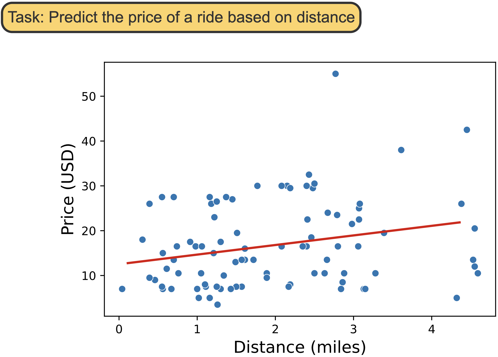

[Machine Learning](https://www.zybooks.com/catalog/machine-learning/) (zyBooks, 2025)

::: notes
In machine learning, we divide features into inputs and outputs.
Input features (also called predictors or explanatory variables) are the known information we feed into the model.
The output feature (also called the target or response variable) is what we want the model to predict.

In our rideshare example:
Input: distance
Output: price

You can think of it like this:
Inputs = what you know
Output = what you want to find out

Choosing the right input features is critical for building accurate models.

FOR NOTES:
Inputs (predictors, $\mathbf{X}$): Variables used to make a prediction
Output (target, response, $\mathbf{y}$): The value we want the model to predict
Task: Predict ride price based on distance
Input feature: distance → model → output feature: price
📌 Think of inputs as "what you know", and outputs as "what you want to find out."
:::

## Knowledge Check

- Goal: predict which nurses are likely to quit
- Which feature is the target?
- Which are the inputs?

| Employee ID | Age | Quit? | Department | Daily rate |
|---|---|---|---|---|
| 1415194 | 34 | No | Maternity | 404 |
| 1620383 | 30 | No | Maternity | 1312 |
| 1533398 | 25 | Yes | Cardiology | 383 |
| 1479961 | 35 | No | Maternity | 982 |
| 1570909 | 38 | No | Cardiology | 508 |

::: notes
Let’s look at another scenario. Suppose a hospital wants to predict which nurses are likely to quit.
They’ve collected data with the following features:
Employee ID
Age
Whether the nurse quit
Department
Daily rate

So here’s your task:
The output feature is: Quit? — that’s what we’re trying to predict.
The input features include: Age, Department, and Daily rate.

Be sure to ignore Employee ID — it’s just an identifier, not a meaningful predictor.
A good rule of thumb is: always ask, Is this feature informative, or just a label?

Hospitals are interested in increasing employee retention, especially for nurses. The following table contains the employee IDs, age, whether or not a nurse recently quit, department, and daily pay rate for a sample of nurses at a large hospital.

Input and output features
Machine learning models use input features to predict the value of an output feature.

Input features are the model's inputs, or explanatory features.

Output features are the model's target feature, or response feature. Input and output features are selected based on the machine learning task, or research question.

FOR NOTES:
What is the output feature (target)?
What is/are the input feature(s)?
Ignore Employee ID — it's an identifier, not a predictive variable.
⚠️ Always ask: "Is this feature informative or just a label?"
Goal: Predict which nurses are likely to quit.
⚠️ Always ask: “Is this feature informative or just a label?”
:::

## Types of Machine Learning

- **Supervised** — data has labels → Regression (predict a number) · Classification (predict a category)
- **Unsupervised** — no labels, find structure → Clustering (group similar rows) · Dimension reduction (compress columns)
- **Reinforcement** — learn from rewards

::: notes
Let’s now take a step back and look at the big picture of machine learning types.

There are several learning paradigms, and choosing the right one depends on your task and the type of data you have.

First, we have Supervised Learning. This is when we train the model using labeled data — that is, we already know the correct answers.
We use it for tasks like regression and classification.

Next is Unsupervised Learning, where we don’t have labeled outcomes. The model’s goal is to find patterns or structure — for example, clustering similar items together or reducing dimensionality.

Then there’s Reinforcement Learning, which is different — here, the model learns by interacting with an environment and receiving feedback in the form of rewards or penalties.
This is used in areas like robotics or game-playing agents.

Later, we’ll also cover semi-supervised and self-supervised learning — two increasingly important techniques in modern ML.

The type of machine learning used depends on the machine learning task.
Predicting the price of a rideshare trip based on distance and time is a supervised learning task, since the output feature (price) is known.
Categorizing customers as "commuters", "sports fans", or "tourists" is unsupervised learning, since these categories are not an observed feature.
Adjusting the price of a rideshare after a customer has declined is reinforcement learning. The prediction is updated based on the customer's decision.

FOR NOTES:
no labels: find structure
:::

## Supervised Learning

- Learns from labeled data: inputs **and** correct outputs
- **Regression** → numbers, e.g., ride price \$17.32
- **Classification** → categories, e.g., cat vs. dog
- 📌 Numeric output = regression; categorical = classification

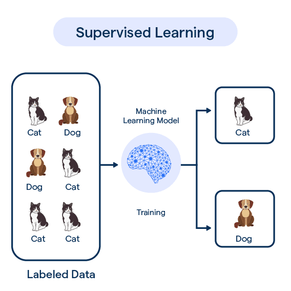

[Supervised Learning: Types and Techniques](https://botpenguin.com/glossary/supervised-learning) (Bot Pengiun, 2024)

::: notes
Let’s zoom in on supervised learning, which is the most common ML approach.

In supervised learning, we give the model a set of input features and the correct output — it learns the relationship between the two.

There are two major categories:
Regression: This is when we predict numeric values. For example, predicting the price of a ride: \$17.32.
Classification: This is when we predict categories or labels. For example, classifying an animal as a cat or a dog.

A quick way to distinguish the two:
If the output is a number, it’s regression.
If the output is a label or class, it’s classification.

We’ll use supervised learning in many of our hands-on examples this semester.

FOR NOTES:
Models learn from labeled data — we give them both inputs and correct outputs.
Regression: Predict numbers
Ex: Predict ride price (e.g., $17.32)
Classification: Predict categories
Ex: Predict animal type: Cat vs. Dog
📌 If the output is numeric, it's regression. If it's categorical, it's classification.
:::

## Unsupervised Learning

- Finds structure in unlabeled data — no output labels
- **Clustering:** commuters, sports fans, tourists
- **Outlier detection:** rides with abnormally high prices
- **Dimensionality reduction:** transforming data, e.g., PCA

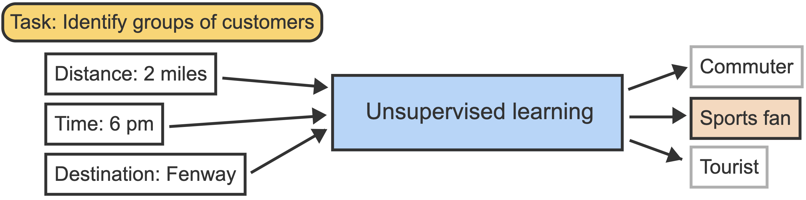

[Machine Learning](https://www.zybooks.com/catalog/machine-learning/) (zyBooks, 2025)

::: notes
Next is unsupervised learning — and this works without labeled data.

The model is given a dataset and asked to discover structure or relationships within it.

Common unsupervised learning tasks include:
Clustering: Grouping instances into meaningful clusters — for example, rideshare customers who behave similarly.
Outlier Detection: Identifying unusual or suspicious instances — like a ride that’s far too expensive.
Dimensionality Reduction: Transforming a dataset with many features into fewer ones — for example, combining time and distance into a ‘trip intensity’ metric.

This is especially useful for exploratory data analysis or when labels are unavailable.

FOR NOTES:
Models find structure in unlabeled data — no output labels provided.
Clustering: Group rides into “commuters”, “sports fans”, “tourists”
Outlier Detection: Find suspicious rides with abnormally high prices
Dimensionality Reduction: Transforming data (e.g., PCA)
:::

## Reinforcement Learning

- Learns by trial and error: take actions, receive feedback
- **Agent:** the decision-maker
- **Environment:** where it operates
- **Reward:** feedback after an action
- Ex: a self-driving car earns rewards for staying in its lane

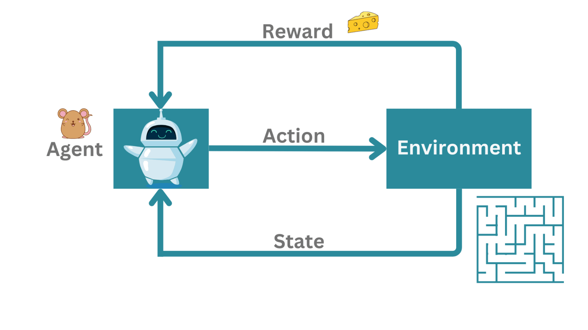

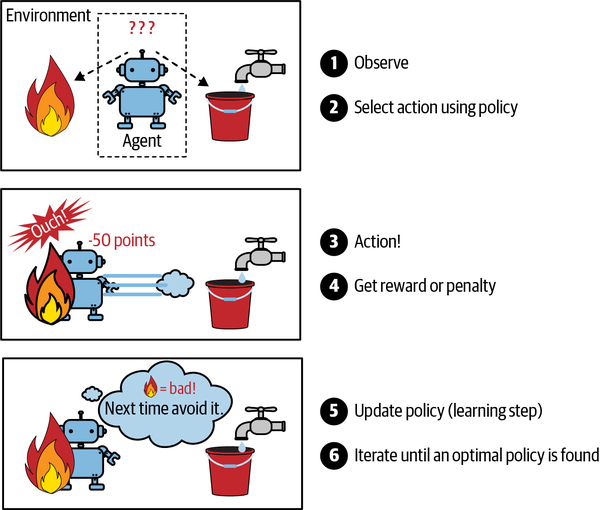

- [Reinforcement Learning: Teaching Computers to Make Optimal Decisions](https://www.kdnuggets.com/2023/07/reinforcement-learning-teaching-computers-make-optimal-decisions.html) (Bala Priya C, 2023)
- [Hands-On Machine Learning with Scikit-Learn, Keras, and TensorFlow](https://www.oreilly.com/library/view/hands-on-machine-learning/9781492032632/) (Aurélien Géron, 2019)

::: notes
Now let’s look at reinforcement learning, which is different from the others.

In reinforcement learning, a model — called an agent — interacts with an environment, takes actions, and learns from rewards or penalties it receives.

Think of a self-driving car learning to stay in its lane.
It receives positive feedback (rewards) when it does well — like staying centered.
It receives negative feedback (penalties) when it makes mistakes — like crossing a lane.

Key components:
The agent makes decisions
The environment provides feedback
The reward is the signal used to improve over time

This type of learning is often used in robotics, game AI, and recommendation systems.

FOR NOTES:
Models learn by trial and error — they take actions and receive feedback.
Ex: A self-driving car earns rewards for staying in its lane
Key terms:
Agent: The decision-maker
Environment: Where it operates
Reward: Feedback after an action
:::

## Semi-Supervised Learning

- Small labeled set + large unlabeled pool
- Ex: 100 rides priced, 10,000 not

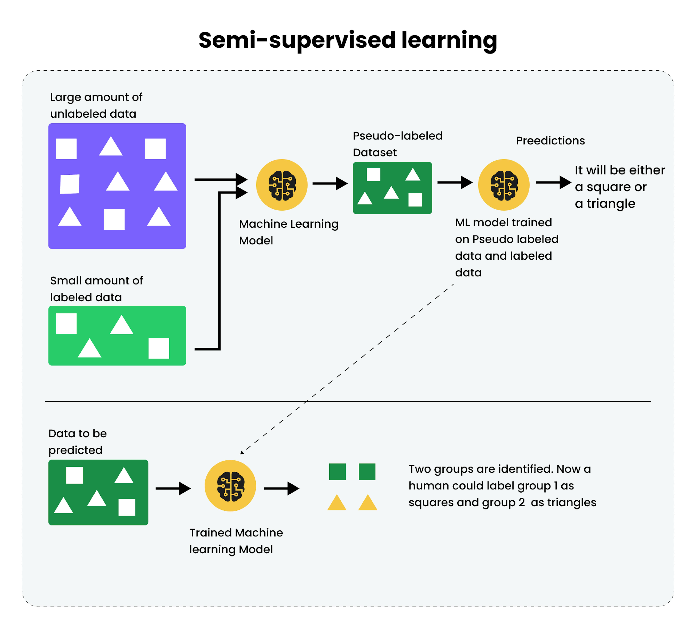

[Semi-Supervised Learning Explained: Techniques and Real-World Applications](https://maddevs.io/blog/semi-supervised-learning-explained/) (Roman Panarin, 2024)

::: notes
Now we get into more nuanced learning strategies — starting with semi-supervised learning.

This approach uses a small amount of labeled data and a large amount of unlabeled data.

Why do this?
Because labeling data can be expensive and time-consuming, but there’s usually lots of unlabeled data available.

Here’s an example:
Suppose you have 100 ride records with labeled prices and 10,000 rides without prices.
You train your model on the small labeled set, and then it begins to generalize by learning from the larger unlabeled set.

Semi-supervised learning is widely used in domains like medical imaging and natural language processing, where labeled data is rare but unlabeled data is abundant

Since labeling data is usually time-consuming and costly, you will often have plenty of unlabeled instances, and few labeled instances.

Some algorithms can deal with data that’s partially labeled.

FOR NOTES:
Combines a small amount of labeled data with a large pool of unlabeled data.
Ex: Only 100 images of rides have prices labeled, but 10,000 don't. The model starts with labeled data, then generalizes by learning from the rest.
Ex: Only 100 images of rides have prices labeled, but 10,000 don’t. The model starts with labeled data, then generalizes by learning from the rest.
:::

## Self-Supervised Learning

- Creates its own labels from unlabeled data
- 📘 NLP: mask a word, train the model to guess it
- 📷 Vision: predict the missing part of an image


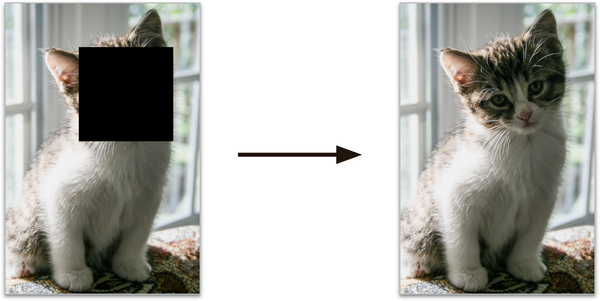

- [Hands-On Machine Learning with Scikit-Learn, Keras, and TensorFlow](https://www.oreilly.com/library/view/hands-on-machine-learning/9781492032632/) (Aurélien Géron, 2019)
- [Self Supervised Representation Learning in NLP](https://amitness.com/posts/self-supervised-learning-nlp) (Amit Chaudhary, 2020)

::: notes
Next, we have self-supervised learning, which is one of the most exciting developments in modern machine learning.

In self-supervised learning, the model is trained without any human-labeled data — instead, it generates its own labels from the input data.

For example, in natural language processing:
You take a sentence and mask a word:
‘The cab arrived at the ___.’
The model learns to predict the missing word — like ‘airport’ — using the surrounding context.

In computer vision, you might cut out part of an image and ask the model to predict what’s missing.

Self-supervised learning is behind the success of large language models like ChatGPT, BERT, and DALL·E.

It’s incredibly powerful because it lets us learn from vast amounts of raw data, without manual annotation.

FOR NOTES:
Learns from unlabeled data by creating its own labels
📘 In NLP, mask a word in a sentence and train the model to guess it:
📷 In vision: Train a model to predict the missing part of an image
:::

## Knowledge Check

Match each task to a learning type:

- Chemotherapy dosage from a patient's response
- Predicting whether a nurse is likely to quit
- Grouping patients from EHRs, no outcome labels
- Pretraining on clinical notes by predicting masked words
- 100 labeled X-rays + 10,000 unlabeled

::: notes
Let’s solidify what we just learned with a quick matching exercise.

Match each machine learning task to the correct learning type:
1. Prescribing a new chemotherapy drug dosage based on a patient’s response → This is Reinforcement Learning. The model is learning by trial and feedback.
2. Predicting whether a nurse is likely to quit → This is Supervised Learning. We’re training on historical data with labels.
3. Identifying high-risk patients based on EHRs → This is Unsupervised Learning. No labels, just clustering based on feature patterns.

These distinctions are really important when designing a machine learning solution — you have to match your data and your problem to the right learning paradigm.

1: Learn from outcomes and adjust (reward-based)
2: Predict yes/no from labeled history
3: No labels — group or score based on similarity

FOR NOTES:
Match the machine learning task with the best type of machine learning: supervised, unsupervised, semi-supervised, self-supervised, or reinforcement learning.
Prescribing a new chemotherapy drug dosage based on a patient's response to earlier treatment.
Predicting whether a nurse is likely to quit.
Grouping patients with similar clinical profiles from EHRs, with no outcome labels
Pretraining a model on clinical notes by predicting masked words
Training a diagnosis model with 100 labeled X-rays and 10,000 unlabeled ones
:::

## Where Are We Now?

- ✅ Introduction to machine learning
- ▶︎ Features and model
- ⏳ Bias-variance tradeoff
- ⏳ Machine learning workflow

::: notes
Let’s pause here for a moment to see where we are in the lecture.

So far, we’ve:
Introduced the basic idea of machine learning
Talked about features, models, and algorithms
Walked through the major types of machine learning: supervised, unsupervised, reinforcement, and hybrid approaches

Next up, we’ll look at how to work with different types of features and start preparing data for model building.
This is a good time to take stock and ask: Are there any concepts you'd like me to revisit?
:::

## Types of Features

- **Categorical:** no numeric meaning — "Yes"/"No", customer type
- **Numerical:** measurable quantities — age, income, amount
- 📌 Some numeric-looking values (e.g., ZIP code) might be categorical.

| distance | cab_type | time_stamp | destination | price | surge_multiplier |
|---|---|---|---|---|---|
| 1.3 | Uber | 08:04.4 | Theatre District | 17.5 | 1 |
| 1.35 | Lyft | 22:57.4 | South Station | 7 | 1 |

[Machine Learning](https://www.zybooks.com/catalog/machine-learning/) (zyBooks, 2025)

::: notes
Now let’s look at feature types, which are incredibly important in machine learning.

Features generally fall into two categories:
Categorical Features: These are variables that represent categories or groups.
They may be strings like ‘Regular’ or ‘New’, or numbers with no inherent order — like ZIP codes.
Example: Yes/No values, Customer type

Numerical Features: These are measurable values where arithmetic operations make sense.
Example: Age, income, transaction amount

One important note: just because a feature is stored as a number doesn’t mean it’s numerical in a mathematical sense.
For example, ZIP codes are typically treated as categorical, because there’s no real arithmetic relationship between them.
Knowing which features are which affects how we process and encode them.

Feature types
Features in a dataset may be categorical or numerical.
A categorical feature has non-numerical values, or numerical values without mathematical meaning. Ex: Yes/no, address, type of customer (regular, occasional, new).
A numerical feature has numerical values with mathematical meaning. Ex: Amount spent on a transaction, square footage of a house.
The actual values in a dataframe may not be enough to determine a feature's type—context matters. Ex: Phone numbers are numerical, but mathematical operations on phone numbers have no meaning. Thus, phone numbers are categorical features.

Features in the rideshare dataframe can be classified as categorical or numerical.
Categorical features have non-numerical values, such as cab type and destination.
Numerical features have numerical values with meaning, such as distance, price, and surge multiplier.
Time stamp is a numerical feature, since mathematical operations on time have meaning. Ex: 2018-12-01 is two days after 2018-11-29.

FOR NOTES:
categorical / numerical (column labels on the source table)
Categorical: Non-numeric or no inherent order – e.g., "Yes"/ "No", Customer Type ("Regular", "New")
Numerical: Measurable quantities with mathematical meaning – e.g., Age, Income, Transaction amount
Categorical: Non-numeric or no inherent order
– e.g., “Yes”/ “No”, Customer Type (“Regular”, “New”)
:::

## Exploratory Data Analysis

- Explore patterns with graphs and summary statistics
- Distributions · correlations · outliers

```python
rides['distance'].hist()
rides.plot.scatter('distance', 'price')
```

- 💡 EDA shapes feature selection and preprocessing

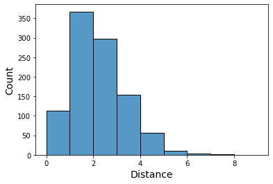

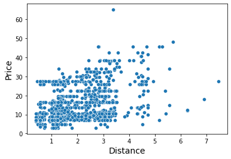

[Machine Learning](https://www.zybooks.com/catalog/machine-learning/) (zyBooks, 2025)

::: notes
Before we train any model, we must explore the data — and that’s where Exploratory Data Analysis, or EDA, comes in.

EDA helps us:
Visualize distributions of data
Detect patterns and correlations
Spot missing values or outliers

Here are a couple of examples:
A histogram like rides[distance'].hist() lets you see the distribution of prices.
A scatter plot like rides.plot.scatter('distance', 'price') helps reveal relationships between two variables.

EDA is both an art and a science. The better you know your data, the better your models will be.
This step often reveals issues — like skewed distributions or missing values — that must be addressed before modeling.

Exploratory data analysis is the process of exploring data via plots and descriptive statistics to identify potential relationships and patterns.

Two popular Python libraries for plotting data are matplotlib and seaborn.
matplotlib is a library for creating static, dynamic, and interactive plots.
seaborn is a high-level library for creating plots that work especially well with dataframes.

FOR NOTES:
Use graphs and summary stats to explore patterns in data
Common EDA tasks: Examine distributions, Visualize correlations, Detect outliers
💡 EDA helps shape feature selection and preprocessing strategies.
:::

## Classification Models

- Predicts **categories** from input features
- Output: discrete class labels — Yes / No
- Ex: accept or decline an offer
- Models: logistic regression, naïve Bayes, k-NN, decision trees, SVM, neural nets

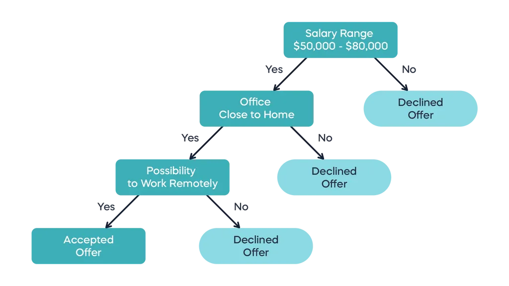

[Introduction to Decision Trees: Why Should You Use Them?](https://365datascience.com/tutorials/machine-learning-tutorials/decision-trees/) (The 365 Team, 2024)

::: notes
Let’s now shift into different types of models — starting with classification models.

Classification models are used when the output we want to predict is a category or label.

Here are a few examples:
Logistic Regression: A linear model used for binary classification
Naïve Bayes: Based on probability and Bayes’ theorem
Decision Trees: Tree-like structures that split the data based on feature values

Example use case: We might want to predict whether a user will accept or decline an offer — so the model outputs a class: Yes or No.
The key thing to remember is: classification problems deal with discrete outputs.

Classification models are supervised machine learning models that classify instances into a predicted level, or class, of a categorical output feature based on the input features.

Classification models may predict the class directly or the probability an instance belongs to a given class. In the probability case, predicted probabilities are compared against a threshold value to produce a class prediction.

In classification, input features may be categorical or numerical, but output features must be categorical.

FOR NOTES:
Predict categories or labels based on input features
Examples: Logistic Regression, Naïve Bayes, k-Nearest Neighbors, Decision Trees, Support Vector Machines, Neural Networks
Example use case: Predict whether to accept (Yes) or decline (No) an offer
Output: discrete class labels – Yes and No
:::

## Regression Models

- Predicts **continuous numbers**
- Output: a real value, e.g., \$70,065
- Ex: predict the salary of an offer
- Models: linear regression, regression trees, k-NN regression

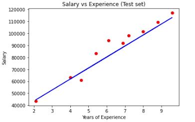

[Simple Linear Regression model to predict the Salary based on Years of Experience](https://medium.com/@yash_kulkarni/simple-linear-regression-model-to-predict-the-salary-based-on-years-of-experience-9ed93a02c5ef) (Yash Kulkarni, 2023)

::: notes
Now contrast classification with regression models.

Regression is used when the output is a continuous numeric value.

For example:
Predicting someone’s salary based on experience
Estimating the price of a rideshare trip

Some common regression models:
Linear Regression: Fits a straight line through the data
Regression Trees: A variant of decision trees tailored for numeric outputs

The important distinction is that regression models predict numbers, not categories.

Later, we’ll walk through coding examples of both classification and regression using scikit-learn.”

Regression models are supervised learning models that predict the value of a numerical output feature based on the input features.

Ex: Simple linear regression is a regression model, since the predicted values are numerical.

Like classification models, categorical or numerical input features may be used in regression.

However, the output feature for a regression model should always be numerical.

FOR NOTES:
Predict continuous numerical values
Examples: Linear Regression, Regression Trees, k-NN regression
Example use case: Predict the salary of an offer
Output: real-valued number (e.g., $70,065)
:::

## Unsupervised Models – Clustering

- Groups similar observations — no labels
- Ex: K-Means, hierarchical clustering
- Use: customer segmentation, behavior profiling
- Output: cluster assignments (Cluster 1, Cluster 2)


[What is clustering](https://developers.google.com/machine-learning/clustering/overview) (Google Machine Learning Education, 2025)

::: notes
Let’s revisit unsupervised models, starting with clustering.

Clustering algorithms group similar instances together, without any labels.

A popular method is K-Means Clustering:
It assigns each instance to one of K groups based on feature similarity.
Another is Hierarchical Clustering, which builds a tree-like structure of nested clusters.

Use cases include:
Customer segmentation: e.g., grouping rideshare users into commuters, tourists, sports fans
Behavior profiling: Identifying usage patterns or lifestyle segments

The output here is not a predicted value but a cluster label — like Group 1, Group 2, and so on.

FOR NOTES:
Group similar observations together without labeled data
Examples:
K-Means clustering
Example use cases: Customer segmentation and behavior profiling
Output: Cluster assignments (e.g., Cluster 1, Cluster 2)
:::

## Unsupervised Models – Outlier Detection

- Finds rare instances that break the pattern
- Ex: DBSCAN
- Use: fraud detection, error checking
- No labels required — anomalies come from the data itself

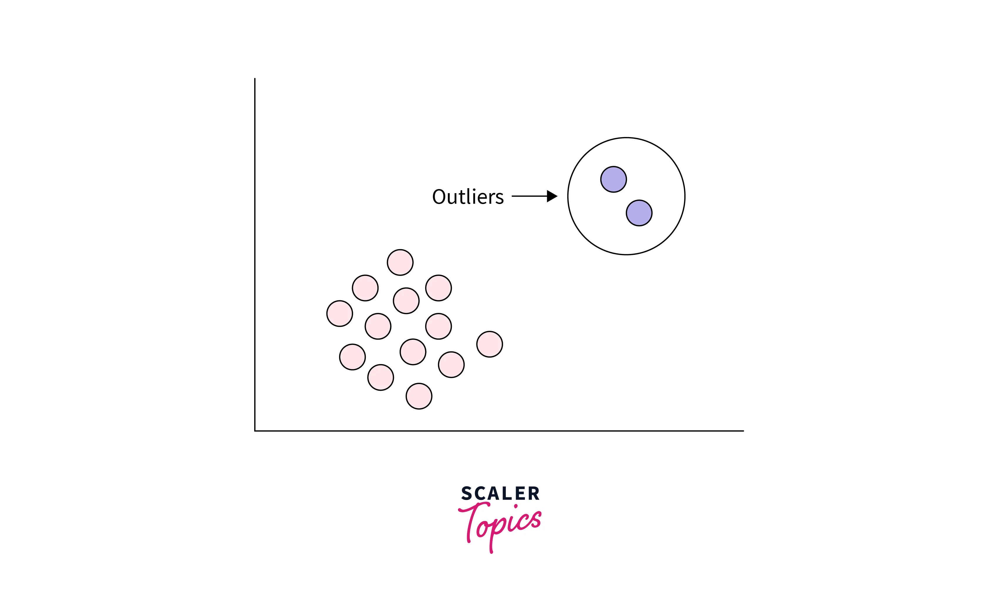

[Outlier Analysis in Data Mining](https://www.scaler.com/topics/data-mining-tutorial/outlier-analysis-in-data-mining/) (Scaler, 2023)

::: notes
Another important type of unsupervised learning is outlier detection.

These models identify instances that are unusual or rare — meaning they don’t fit the general pattern of the data.

One useful algorithm here is DBSCAN, which can detect outliers as a byproduct of clustering.

Use cases include:
Fraud detection: Spotting abnormal transactions
Data cleaning: Identifying potential entry errors or system glitches

These models don’t require labeled data — they work by comparing each point’s behavior to others in the dataset.
It’s a very practical technique, especially when working with real-world, noisy datasets.”

FOR NOTES:
Identify rare or unusual instances that don’t fit the general pattern
Example:
Example use cases:
Error checking
No labels required — algorithm finds anomalies from data itself
:::

## Unsupervised Models – Dimension Reduction

- Simplifies high-dimensional data, keeps the structure
- Ex: PCA — combine distance & time into features capturing variance
- Use: compression, noise reduction, 2D visualization

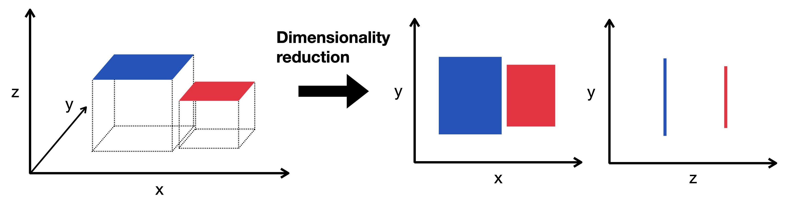

[Dimension Reduction](https://www.sc-best-practices.org/preprocessing_visualization/dimensionality_reduction.html) (Anna Schaar, 2023)

::: notes
The third major category of unsupervised models we’ll look at is dimensionality reduction.

This technique is used to transform high-dimensional datasets into simple versions, while preserving as much useful information as possible.

The most common method is PCA — Principal Component Analysis.

PCA transforms the original features into a smaller number of new, uncorrelated variables called principal components.

Think of it like combining features that are strongly related into a single, more informative feature.

Example use cases include:
Data compression: Reducing storage or transmission requirements
Noise reduction: Removing irrelevant or redundant features
Visualization: Reducing data to 2D or 3D so it can be plotted

Dimensionality reduction is often a crucial step before clustering or classification when your dataset has dozens or hundreds of features.

FOR NOTES:
Simplify high-dimensional data while keeping important structure
Example: Principal Component Analysis (PCA)
Combine features (e.g., distance & time) into new features capturing variance
Example use cases:
Visualization (e.g., reduce to 2D for plotting)
:::

## Knowledge Check

Match each task to: dimension reduction, outlier detection, or clustering.

- Group customers as "frequent user", "sports fan", "commuter"
- Identify customers with unusual behavior
- Combine trip distance and rating into a quality measure

::: notes
Let’s check your understanding of unsupervised models with a quick match-the-task activity.
1. Group rideshare customers into categories like 'frequent user', 'sports fan', or 'commuter' — this is clustering.
2. Identify customers with unusual behavior — this is outlier detection.
3. Combine trip distance and rating into a single 'quality' score — that’s dimensionality reduction.

These distinctions matter because even though all of these techniques use unlabeled data, they serve very different purposes.

Knowing which one to use depends on your goal: discover patterns, find anomalies, or simplify data.

FOR NOTES:
Match the machine learning task to the type of unsupervised model: Dimension reduction, outlier detection, and clustering.
Group rideshare customers into categories such as "frequent user", "sports fan", and "commuter".
Identify customers with unusual behavior.
Combine trip distance and rating into a quality measure.
:::

## Where Are We Now?

- ✅ Introduction to machine learning
- ✅ Features and model
- ▶︎ Bias-variance tradeoff
- ⏳ Machine learning workflow

::: notes
We’ve now wrapped up our overview of learning paradigms and model types, both supervised and unsupervised.
Just to recap, you should now understand the difference between:
Regression vs. Classification
Clustering vs. Outlier Detection
And how dimensionality reduction fits into the process

Up next, we’ll look at the machine learning workflow — that is, how we build a model from raw data using Python and scikit-learn.
:::

## Generalization: The Goal of Machine Learning

- A model that memorizes its training data can score 100% on it and still be useless
- What matters is performance on data it has **not** seen
- That target is **generalization**
- The test set estimates it: it simulates the future

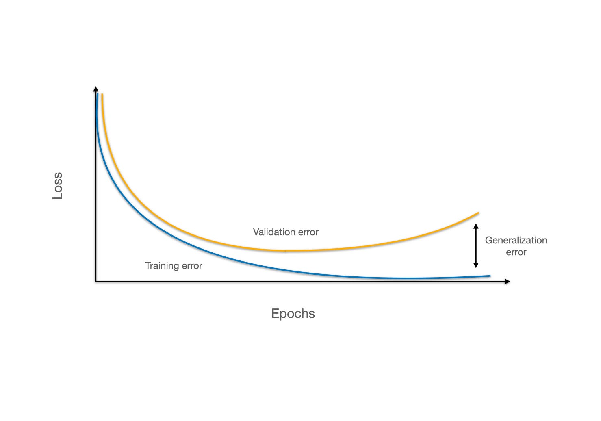

::: notes
FOR NOTES:
A model that memorizes its training data can score 100% on it and still be useless.
We do not care how well a model does on data it has seen. We care how well it does on data it hasn’t.
That target — performance on unseen data — is called generalization.
The test set exists to estimate it: it simulates the future.
:::

## What is Bias in ML?

- Systematic error from overly strong assumptions
- Persists no matter how much data you collect
- High bias → too simple → **underfits**
- Ex: predicting every ride's price with one constant

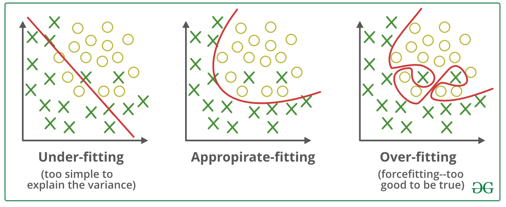

[Predicted vs. Actual](https://support.monolithai.com/support/solutions/articles/80000953338-predicted-vs-actual) (Monolith AI, 2023)

::: notes
Let’s start with bias.

In machine learning, bias is not a social or ethical term — it refers to error caused by incorrect assumptions in the model.

More formally:
The error for one instance is:
ei=yi−y^ie_i = y_i - \hat{y}_iei=yi−y^i

The bias is the average error across all predictions:
Bias=mean(ei)\text{Bias} = \text{mean}(e_i)Bias=mean(ei)

A model with high bias is too simple to capture the true patterns in the data.
It consistently underperforms — this is called underfitting.
Example: using a constant value to predict ride prices would lead to large, systematic errors — regardless of the input.

A model without bias is unbiased — the mean difference between the predicted value and observed value is always 0.

Ex: Least squares regression is a regression model in which the weights are estimated such that the bias is guaranteed to be 0.

Bias may result from poor model fitting or violated model assumptions.

Underlying systematic errors in the data, such as underrepresenting a particular group or failing to measure an important feature, may also result in bias.

FOR NOTES:
Bias is a systematic error from overly strong assumptions
The part of the error that persists no matter how much data you collect
High bias → model too simple → underfits.
Example: predicting every ride's price with a single constant.
:::

## What is Variance in ML?

- How much predictions fluctuate across subsets of the same data
- High variance → too complex → **overfits**
- Right on one dataset, wrong on the next

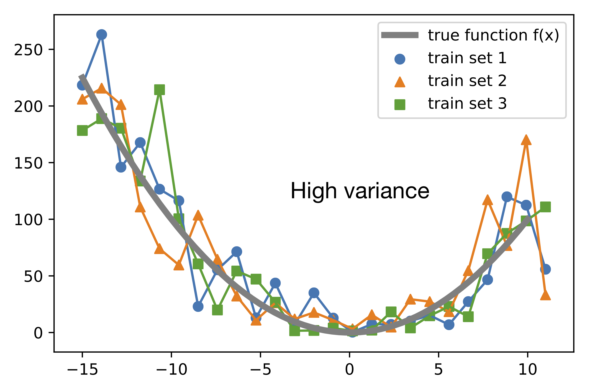

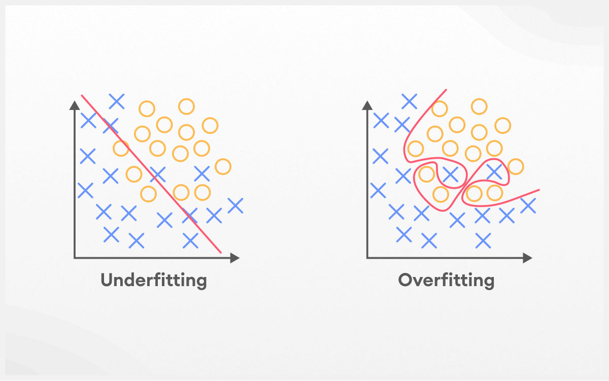

[Bias-variance decomposition for classification and regression losses](https://rasbt.github.io/mlxtend/user_guide/evaluate/bias_variance_decomp/) (mlxtend)

::: notes
Now let’s look at the other side of the coin: variance.

Variance refers to how much a model’s predictions fluctuate when trained on different datasets.

You might have a model that performs really well on the training data — but if it changes drastically with every new sample, it has high variance.

This is often a sign of overfitting — the model is memorizing the noise in the training set instead of learning general patterns.

So to recap:
High bias = model is too simple → underfitting
High variance = model is too complex → overfitting

Our goal is to strike a balance between these two.

Variance is the average squared difference between an observation and the mean.

Error variance is the variance of a model's prediction errors.

Models with low bias and low error variance have predicted values that are consistently close to the observed values. A good model should have low bias and low error variance.

FOR NOTES:
Variance measures how much predictions fluctuate across different subsets of the same dataset.
High variance means model is too complex, thus, overfits training data
Your model gets all answers right on one dataset but fails on new ones.
:::

## Bias-variance Trade-off

- Simple models: high bias, low variance
- Complex models: low bias, high variance
- Goal: the sweet spot — best generalization


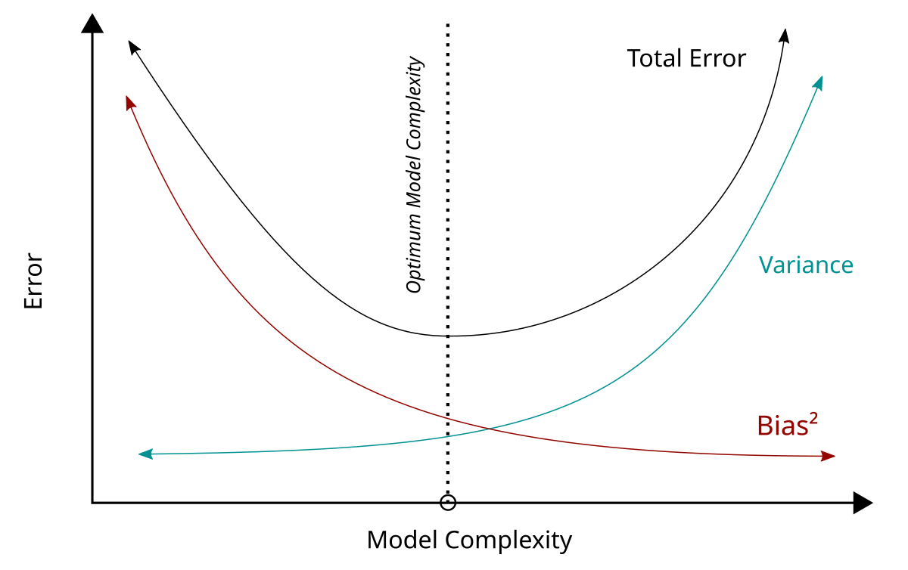

[Bias–variance tradeoff](https://en.wikipedia.org/wiki/Bias%E2%80%93variance_tradeoff) (Wikipedia, 2025)

::: notes
So how do bias and variance interact?

There’s a trade-off:
Simple models tend to have high bias but low variance — they miss patterns but are stable
Complex models have low bias but high variance — they capture detail but might not generalize

Your job as an ML practitioner is to find the sweet spot:
A model that’s complex enough to capture key relationships
But not so complex that it overreacts to noise

This is why we split data into training and test sets, and why we monitor model performance carefully during tuning.

Understanding this tradeoff helps you choose appropriate models, adjust their complexity, and improve generalization.

Archery target diagram:
High bias: off-center grouping
High variance: scattered shots
Balanced: tight grouping near center

Prediction is like attempting to hit a bullseye on a target. A good model consistently (low error variance) hits the bullseye (low bias).
A model with low bias and high error variance occasionally hits the bullseye but is less consistent.
A model with high bias and low error variance consistently hits the same spot on the target, just not the center.
The worst case scenario is a model with high bias and high error variance. Models with high bias and error variance are inaccurate and inconsistent.

FOR NOTES:
High bias, Low variance
Low bias, High variance
Goal: Find the sweet spot where both are balanced for best generalization.
:::

## Generalizing

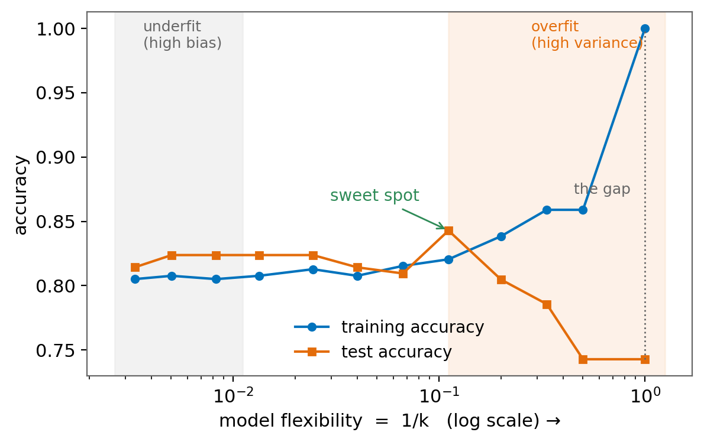


- Training accuracy rises monotonically; test accuracy rises, peaks, then falls.
- The goal is to find the sweet spot: enough model complexity to learn the underlying pattern in the dataset.

## Knowledge Check

- Which model has the greatest prediction variance?
- Which model is most likely underfitted?

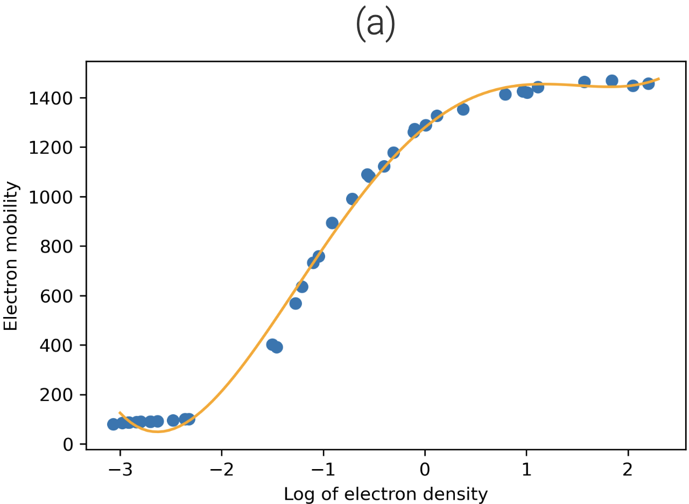

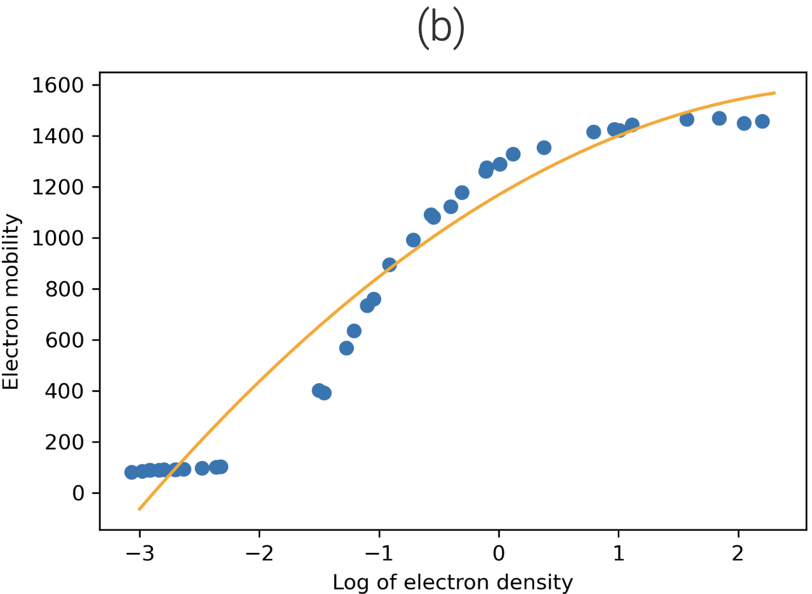

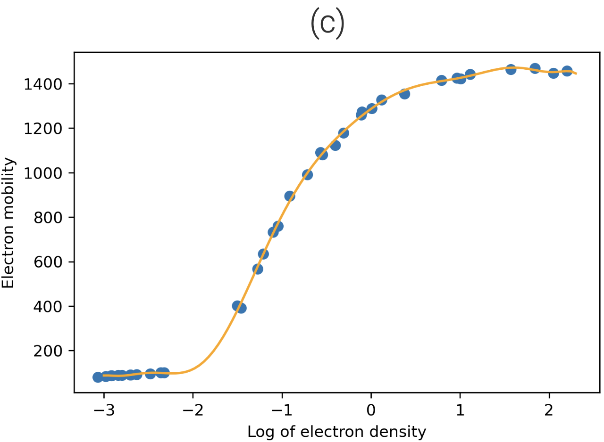

[Machine Learning](https://www.zybooks.com/catalog/machine-learning/) (zyBooks, 2025)

::: notes
Let’s apply what we just learned with a visual knowledge check.

Take a look at the three models shown in the graphs. Each one represents a different kind of fit:
Model A shows a straight line far from most points — that’s underfitting, or high bias.
Model B fits the data well and generalizes — that’s the ideal fit.
Model C is too wiggly, hugging every data point — this is overfitting, or high variance.
These visual cues are often more intuitive than equations, and you’ll see them again in diagnostics later in the course.
Understanding this trade-off helps you recognize when your model is doing too little or too much.

Knowledge Check – Error Patterns
Examine the models:
1️⃣ Which shows highest prediction variance? → Model C
2️⃣ Which is most underfitted? → Model A
✅ Model A: flat, underfitted
✅ Model C: highly curved, overfitted
✅ Model B: balanced

FOR NOTES:
Given the following graphs
Which of the models has the greatest prediction variance?
Which model is most likely to be underfitted?
:::

## Where Are We Now?

- ✅ Introduction to machine learning
- ✅ Features and model
- ✅ Bias-variance tradeoff
- ▶︎ Machine learning workflow

::: notes
We’ve now completed the machine learning workflow portion of our session.
Let’s review:
We explored how models are built using training data
We discussed model evaluation and why testing on new data is critical
And we just launched into practical exercises with scikit-learn

Coming up next, we’ll look at one of the most important theoretical concepts in ML — the bias–variance tradeoff.
This helps us understand why some models perform well and others fail, even when the training looks good.
:::

## Machine Learning Workflow

1. **Frame** — what is x? what is y? what is success?
2. **Get & split data** — hold some data back
3. **Preprocess** — clean, encode, scale
4. **Train** — fit a model to training data
5. **Evaluate** — metrics on held-out data
6. **Interpret & act** — explain, decide, communicate

::: notes
Here’s what a typical machine learning workflow looks like using scikit-learn.

Step by step:
Load and split the data — using train_test_split() to create training and test sets
Preprocess features — scale, encode, or impute values as needed
Choose a model — such as LinearRegression or DecisionTreeClassifier
Fit the model on the training data
Evaluate on the test data — using accuracy, mean squared error, etc.
Tune and deploy — improve performance, then move it into production if needed

This structure will be the foundation of everything we do in this course — we’ll refer back to this workflow again and again.

Input and output features are separated into two dataframes: X and y.
Each estimator is loaded, or initialized, into the Python workspace. Any user-defined settings are specified during initialization.
The .fit() method estimates model parameters, such as regression weights, or applies an algorithm to the input and output features.
The .predict() method calculates predicted values for a set of inputs, either new values or the original inputs.
The .score() method calculates a performance metric based on the type of machine learning task.

FOR NOTES:
A typical ML pipeline includes: (lead-in line from the source slide)
what is x? what is y? what does success mean?
Fit a model to training data
:::

## Introduction to scikit-learn

- Python library for building ML models
- Key concept: an **estimator** fits a model or algorithm

```python
from sklearn.linear_model import LinearRegression
model = LinearRegression().fit(X_train, y_train)
```

- Covers supervised + unsupervised models, preprocessing, training, evaluation

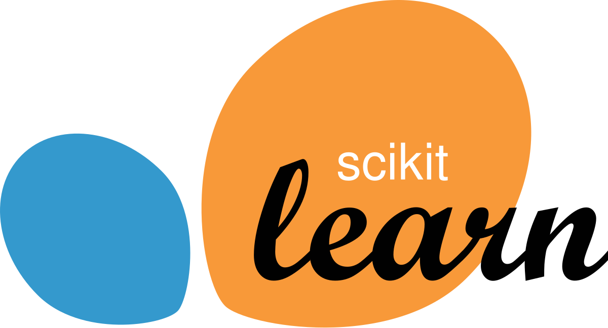

[Scikit-learn](https://scikit-learn.org/stable/)

::: notes
To build machine learning models in Python, we’ll be using scikit-learn — one of the most widely used ML libraries.

It’s easy to learn, well-documented, and great for building both supervised and unsupervised models.

A central concept in scikit-learn is the estimator:
An estimator is any object that can fit a model to data.
For example, LinearRegression() is an estimator used to fit a simple regression model.
In code, we use .fit() to train the model:

scikit-learn also includes tools for:
Preprocessing data
Splitting datasets
Evaluating model performance

We’ll use all of these components in the workflow you’re about to see.

FOR NOTES:
scikit-learn is a popular Python library for building ML models.
Key concept: Estimator — an object that fits a model or algorithm. Ex: LinearRegression() trains a linear model.
scikit-learn supports: Supervised + Unsupervised models, Preprocessing, Training, Evaluation.
An object that fits a model or algorithm
:::

## Practice: The ML Workflow

- Build a supervised learning pipeline, then evaluate it
- 📥 Download `modeling_the_ml_workflow.ipynb` from Canvas
- 🌐 Open [https://colab.research.google.com](https://colab.research.google.com/)
- ⬆️ Upload and run the notebook

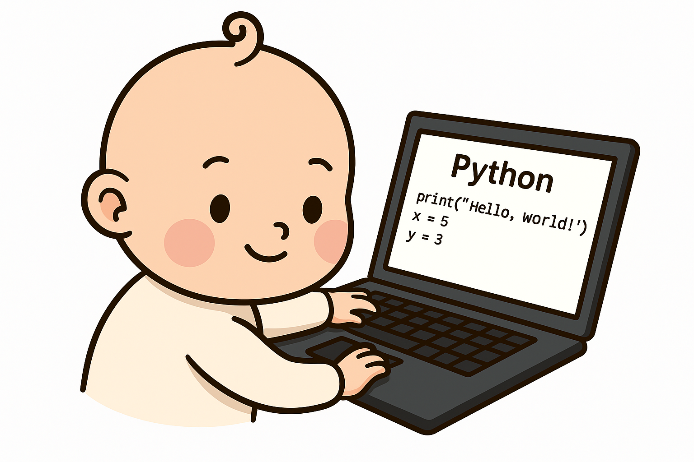

DALL·E (ChatGPT), 2025

::: notes
Now it’s your turn to apply what we just discussed in a hands-on lab.

This exercise will walk you through the full machine learning workflow using scikit-learn — from data loading to model evaluation.

You’ll learn to:
Build a supervised learning pipeline
Split your data into train and test sets
Fit a model to training data
Evaluate the model’s performance on unseen data

To begin:
Download the notebook modeling_workflow_in_scikit_learn.ipynb from Canvas
Open it in colab.research.google.com
Upload and run the notebook cells

This lab is designed to reinforce the workflow we just discussed and build your confidence in using Python for end-to-end machine learning.

FOR NOTES:
Lab Goals: Build a supervised learning pipeline; Evaluate model performance.
:::

## Summary – Key Takeaways

- Machine learning learns patterns from data to make predictions or discover structure.
- The learning approach depends on the data, labels, and task.
- Successful models must perform well on unseen data, not just training data.

::: notes
Let’s wrap up with a quick summary of what we’ve covered today.

You should now be able to:
Define key ML terms: dataset, features, models, algorithms
Distinguish among the main learning types:
Supervised → labeled data
Unsupervised → unlabeled data
Semi- and self-supervised → mix or auto-generated labels
Reinforcement learning → reward-based learning
Implement an ML workflow using scikit-learn — from loading data to evaluating models
Explain the bias–variance tradeoff and recognize underfitting vs. overfitting
Apply the W3C’s 10 ethical principles to guide responsible ML system design
These foundational ideas will carry through the rest of the course — from labs and projects to your final assessment.

Core ML Vocabulary
You can now speak the language of machine learning: datasets hold the raw observations; features are the measurable attributes; labels/targets are the truths we aim to predict; a model is the mathematical function fθf_{\theta}fθ we train; an algorithm is the procedure that tunes θ\thetaθ; and the training / test split lets us judge how well the model generalizes.
Four Learning Paradigms
You can distinguish when to use
Supervised learning (labeled data, e.g., image classification),
Unsupervised learning (no labels, e.g., customer clustering),
Semi- / Self-supervised learning (leveraging unlabeled data, e.g., masked-token language models), and
Reinforcement learning (agents learn by reward, e.g., game-playing AIs).
End-to-End ML Workflow in scikit-learn
Starting with a CSV, you can now:
train_test_split → preprocessing.Pipeline → model.fit → metrics.evaluate.
This pipeline mindset structures every future project—from data ingestion and feature engineering to model tuning and evaluation.
Ethical Design Principles
Fairness, transparency, privacy, and accountability are not add-ons—they shape model choices, data collection, and deployment strategies. You should now be able to identify at least one concrete design or policy decision that supports each principle.
:::

## Further Reading

- 📘 [A Hands-On Introduction to Machine Learning](https://www.cambridge.org/highereducation/books/a-hands-on-introduction-to-machine-learning/3E57313A963BF7AF5C6330EB88ADAB2E#overview) (Chirag Shah, 2022)
  - 📖 Read Chapter 1
- [Google’s ML Crash Course](https://developers.google.com/machine-learning/crash-course)
- [How to Prevent Overfitting](https://medium.com/swlh/machine-learning-how-to-prevent-overfitting-fdf759cc00a9) (Ken Hoffman, 2021)

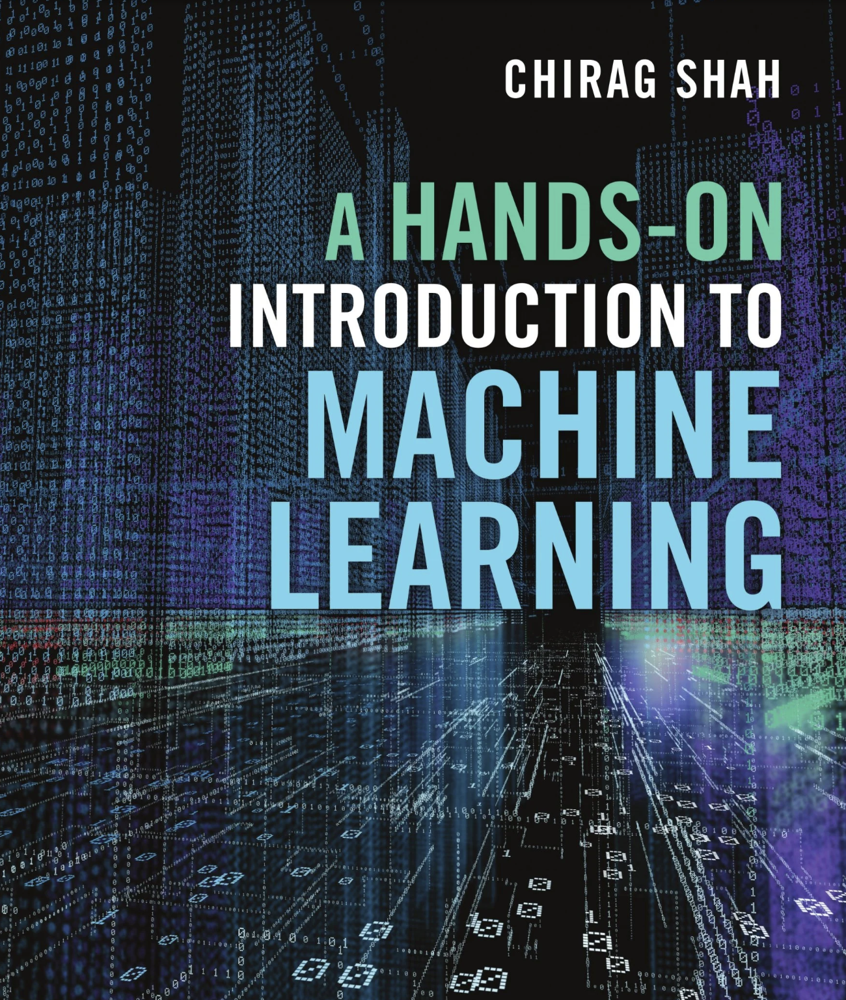

::: notes
To reinforce what you’ve learned and go a bit deeper, here’s some recommended reading.

Start with Chapter 1 of A Hands-On Introduction to Machine Learning by Chirag Shah.
It expands on many of the ideas we’ve introduced today with real-world case studies.

If you need a Python refresher, skim Chapter 2 — especially if you’re new to Jupyter notebooks or pandas.

Optional but valuable:
Google’s ML Crash Course — it’s beginner-friendly and includes interactive exercises.
How to Prevent Overfitting by Ken Hoffman — a quick read that reinforces the bias–variance concepts.

Use these as a springboard — especially if you want to explore topics like fairness, model tuning, or ethics in more detail.
:::
